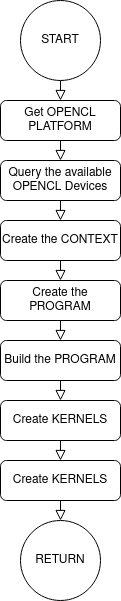

#My OPENCL Notes  
2022-12-25  
cgonzalezbrito  
## Introduction  
  TODO
## Host Programming  
The program on the host is responsible for the initialization, coordination of kernels execution and data transfer to the kernels. The host creates the initial data buffers that are used by the kernel in charge of normalizing and writing the data into FIFO buffer channels.  
{: .center-image}

